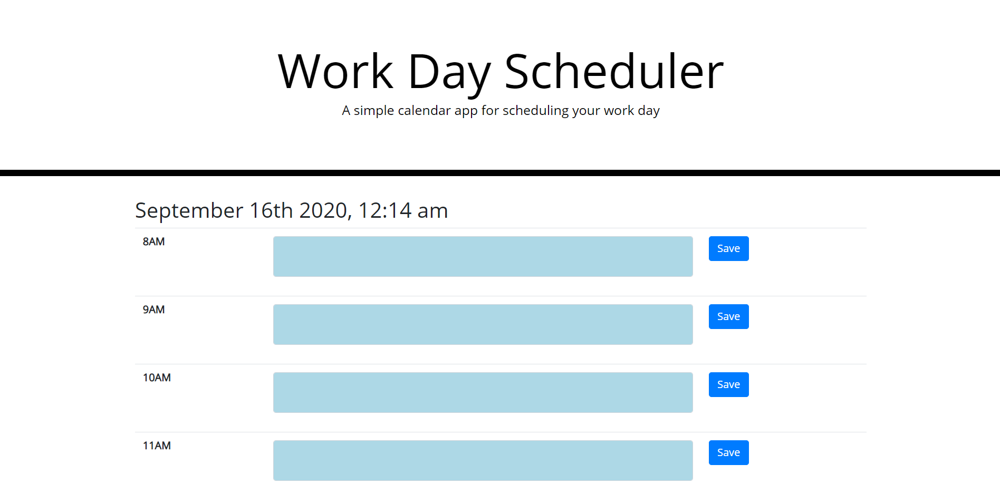

# calendarApp

Link to deployed page: https://alhoffiq.github.io/calendarApp/

Textboxes are colored to show if that time field has already passed or is close to passing.
Grey boxes have already happened, yellow will end in less than an hour, and blue ones are later in the day.

Entering text into the fields will save into local storage only if the save button is clicked and each text box will populate with text from local storage on start.

